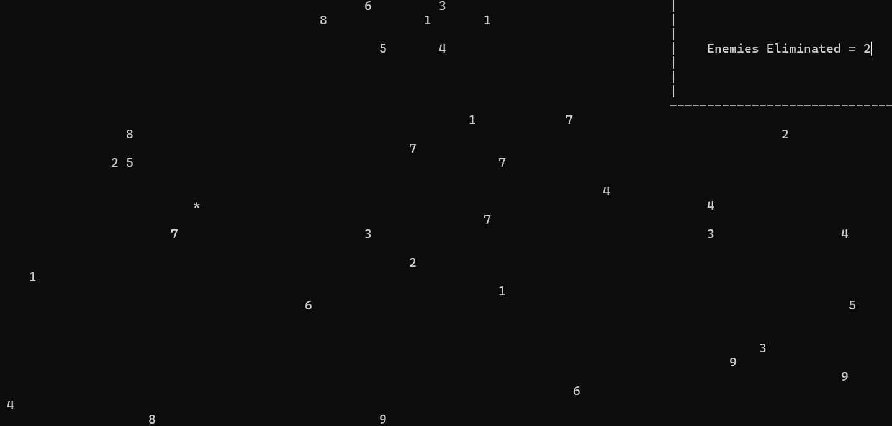
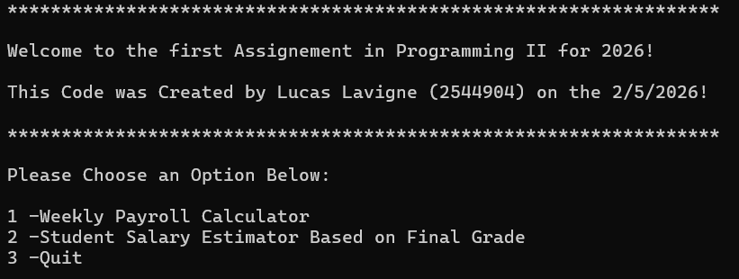

# Project 1
## The Cursor Game
### Short Description:
 This game was made for the programming 1 course as a final project. Essentially this game uses the arrow keys to move your character around and many other numbers are displayed around as you spawn in. 10 enemies are randomly selected and if you step over too many, the ending prompt changes.

### Tech Used:
---
The program in terms of logic and structure and doesnt use too many complexe terms due to being a first semester project. The main backbone of the game are a few arrays and the x, y postions. 

Board Example Once Printed:

### Code Snippets:
__To Determine the Randomized "Dangerous" Enemies:__
```
        static void SpecialEnemyDeterminer()
        {
            Int32 Counter,Arraysize,RndArrayNb;
            Arraysize = Globals.EnemyCount;
            for (Counter = 0; Counter < Globals.SpecialEnemyLimit; Counter++)
            {
                RndArrayNb = Globals.rnd.Next(0, Arraysize-1);
                Globals.SpecialEnemyXPosition[Counter] = Globals.EnemyXPosition[RndArrayNb];
                Globals.SpecialEnemyYPosition[Counter] = Globals.EnemyYPosition[RndArrayNb];
            }

        }
```

__Check to see if Character = Enemy Position__
```
        static void EqualEnemyPositionCheck()
        {
            Int32 Counter;
            for (Counter = 0;Counter < Globals.EnemyCount;Counter++)
            {
                if(Globals.XPosition == Globals.EnemyXPosition[Counter] && Globals.YPosition == Globals.EnemyYPosition[Counter])
                {
                    Globals.NbEliminiated++;
                    Globals.EnemyXPosition[Counter] = 999;
                    Globals.EnemyYPosition[Counter] = 999;
                }
                if(Globals.XPosition == Globals.SpecialEnemyXPosition[Counter] && Globals.YPosition == Globals.SpecialEnemyYPosition[Counter])
                {
                    Globals.NbSpecialEliminated++;
                    Globals.SpecialEnemyXPosition[Counter] = 999;
                    Globals.SpecialEnemyYPosition[Counter] = 999;
                }
            }
        }
```
There is a few things overall i believe i could have improved on...

Mainly:
* Integrating foreach loops instead of normal for loops
* Using 2D Loops 

But I did learn alot about the structure of video games!

# Project 2
## Second Programming II Assignement
### Short Description:
This program as the name suggests was for my most recent assignement for programming II. It is the most "advanced" programme i've written, while not perfect i am decently proud. It answers question 1, to calculate a multitude of pays for fake employees and question 2 where it calculates the pay for students based on their grades.
>Why did Half the Class Use AI...?  
>-The Teacher Probably 

### Tech Used:
This programs structure is much more organized than the previous one and uses more methods and a menu for clearer understanding of what is going on. It uses alot of arrays, case switches and string interpolation.

Example of Menu:

### Code Snippets:
__Example of a Better Organized Method:__
```
            int counter = 0;
            ushort numberofStudents;
            string[] firstNameArr;
            string[] lastNameArr;
            byte[] finalGrades;
            decimal[] salary; 

            numberofStudents = GetNumberofStudents();

            firstNameArr = new string[numberofStudents];
            lastNameArr = new string[numberofStudents];
            finalGrades = new byte[numberofStudents];
            salary = new decimal[numberofStudents];

            PopulateFirstNames(numberofStudents,firstNameArr, counter);
            PopulateLastNames(numberofStudents, lastNameArr, counter);
            PopulateFinalGrades(numberofStudents,finalGrades,counter);
            PopulateSalaryBasedOnGrade(finalGrades,salary);
            PrintData(firstNameArr, lastNameArr, finalGrades, salary);
            Console.WriteLine("                                ");
            Console.WriteLine("-- Press Anything to Continue --");
            Console.WriteLine("                                ");
            Console.ReadLine();
```
__String Interpolation:__
```
            int SID;
            Console.Clear();
            Console.WriteLine("SID\tFirst Name\tLast Name\tFinal Grade\tSalary");
            for (SID = 0; SID < firstNameArr.Length ; SID++)
            {
                Console.WriteLine($"{SID + 1}\t{firstNameArr[SID]}\t\t{lastNameArr[SID]}\t\t{finalGrades[SID]}%\t\t{salary[SID].ToString("c")} ");
            }
```
This program could also benefit from foreach loops but im happier with the structure and logic from this assignement. I learnt alot on actually structuring well and building around someone else's structure (the teacher).

# Subjective Comparison
|Name|Difficulty|Satisfaction|To Improve|
|---|---|---|---|
|Cursor Game|**|Decent|Structure|
|Assign2 Programming II|***|Happy|A Few Logical Errors|